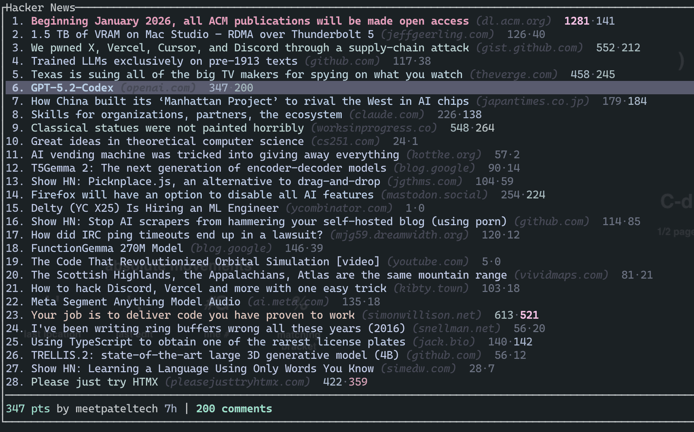
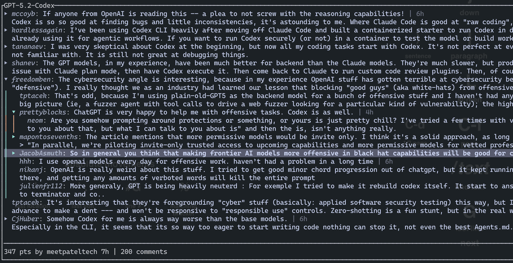

# hntui

Hacker News TUI (top stories + nested comments) using the official Firebase API.

## Screenshots




## Run

```bash
cargo run --release
```

Options: `--count`, `--page-size`, `--cache-size`, `--concurrency`, `--no-file-cache`, `--file-cache-dir`, `--file-cache-ttl-secs`, `--base-url`, `--ui-config`

UI config: `ui-config.toml` (TOML, comments supported)
Search order (unless `--ui-config`): `./ui-config.toml`, binary dir, OS config dir (ProjectDirs)
If none found, built-in defaults are used.
Layout keys: `comment_max_lines` (`-1` = unlimited), `comment_default_visible_levels` (1 = top only, 2 = top + replies)
Font config removed; set font/size in terminal emulator.
Score/comment color scales: `score_scale.steps`, `comment_scale.steps` (desc min thresholds; last min = 0).

## Cache

- Disk cache: HN items + story list state (restore instantly, refresh in background)
- TTL (items only): `--file-cache-ttl-secs` (default 3600)
- Disable: `--no-file-cache`

## Keys

Stories:
- `j/k` or `↓/↑`: move
- `gg` / `G`: top / bottom
- `Ctrl+d` / `Ctrl+u`: page down / up
- `Enter` / `Space` / `l` / `→`: open comments
- `o`: open source link in browser
- `O`: open comments page in browser
- `r`: refresh
- `?`: help
- `q` / `Esc`: quit

Comments:
- `j/k` or `↓/↑`: move
- `gg` / `G`: top / bottom
- `Ctrl+d` / `Ctrl+u`: page down / up
- `h` / `←`: collapse selected thread
- `l` / `→`: expand selected thread (lazy-load children)
- `Enter` / `c`: toggle collapse/expand
- `o`: open comments page in browser
- `O`: open source link in browser
- `r`: refresh
- `?`: help
- `q` / `Esc`: back
