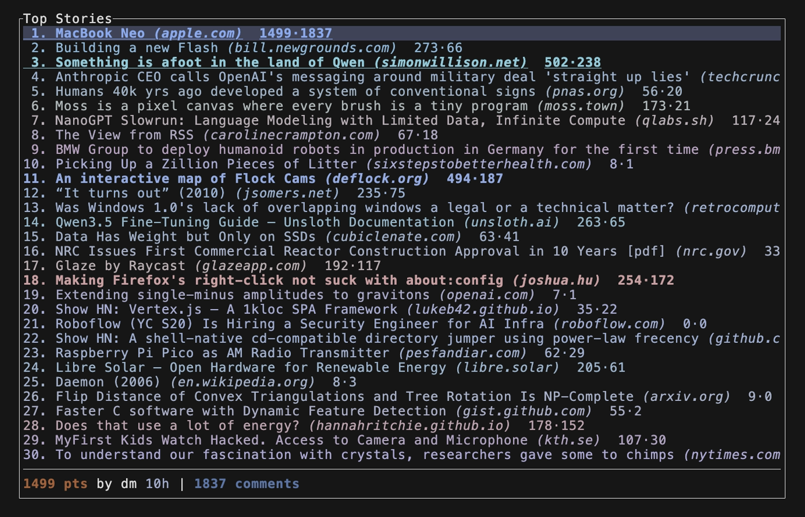
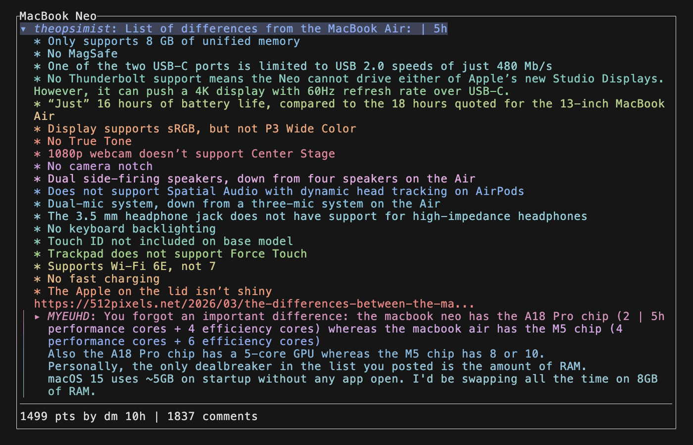

# hntui

Hacker News TUI — top stories + nested comments.

## Demo


## Screenshots




## Install

```bash
# macOS / Linux Homebrew
brew install rocrp/tap/hntui

# Linux (no Homebrew)
curl -fsSL https://raw.githubusercontent.com/rocrp/hntui/main/scripts/install.sh | bash
```

## Keys

**Stories**

| Key | Action |
|-----|--------|
| `j/k`, `↓/↑` | Move |
| `gg` / `G` | Top / bottom |
| `Ctrl+d/u` | Page down / up |
| `Enter`, `Space`, `l`, `→` | Open comments |
| `o` / `O` | Open source / HN link |
| `f` | Filter feed |
| `/` | Search |
| `s` | Summarize (requires LLM key) |
| `r` | Refresh |
| `,` | Settings |
| `?` | Help |
| `q`, `Esc` | Quit |

**Comments**

| Key | Action |
|-----|--------|
| `j/k`, `↓/↑` | Move |
| `gg` / `G` | Top / bottom |
| `Ctrl+d/u` | Page down / up |
| `h/l`, `←/→` | Collapse / expand thread |
| `Enter`, `c` | Toggle collapse |
| `o` / `O` | Open HN / source link |
| `y` | Copy selected comment |
| `s` | Summarize (requires LLM key) |
| `r` | Refresh |
| `,` | Settings |
| `q`, `Esc` | Back |

**Touch / Mouse** (Termux, etc.)

| Gesture | Action |
|---------|--------|
| Tap item | Select it |
| Tap selected item | Open comments / toggle collapse |
| Scroll up/down | Move selection |
| Tap title bar (comments) | Go back |
| Tap outside popup | Dismiss |

## Configuration

The UI uses a fixed Catppuccin Frappé theme.

### Config search order

1. Current working directory
2. `hntui` binary directory
3. `~/.config/hntui/` (recommended)

Explicit config path: `hntui --config PATH`

### AI summarization (`config.toml`)

Press `s` on any story to summarize its discussion. Requires an LLM API key.

```bash
curl -fsSL https://raw.githubusercontent.com/rocrp/hntui/main/config.toml \
  -o ~/.config/hntui/config.toml
```

```bash
export HNTUI_LLM_API_KEY="your-key-here"
```

Or set `api_key` in `config.toml`. Default uses Gemini (`gemini/gemini-flash-lite-latest`). For OpenAI:

```toml
[summarize]
model = "openai/gpt-4o-mini"
```

The `model` field uses smolllm's `provider/model_name` format. Comma-separate
for fallback (`"openai/gpt-4o, gemini/gemini-flash-lite-latest"`). See
[smolllm-rs](https://github.com/rocrp/smolllm-rs) for the full provider list.
Optional `base_url` overrides the provider's default endpoint.

`hntui` auto-loads `~/.env.smolllm` if it exists (process env always wins).
Pass `--env-file <path>` to load a different file explicitly.
