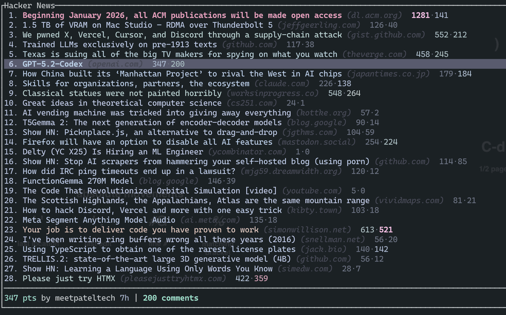
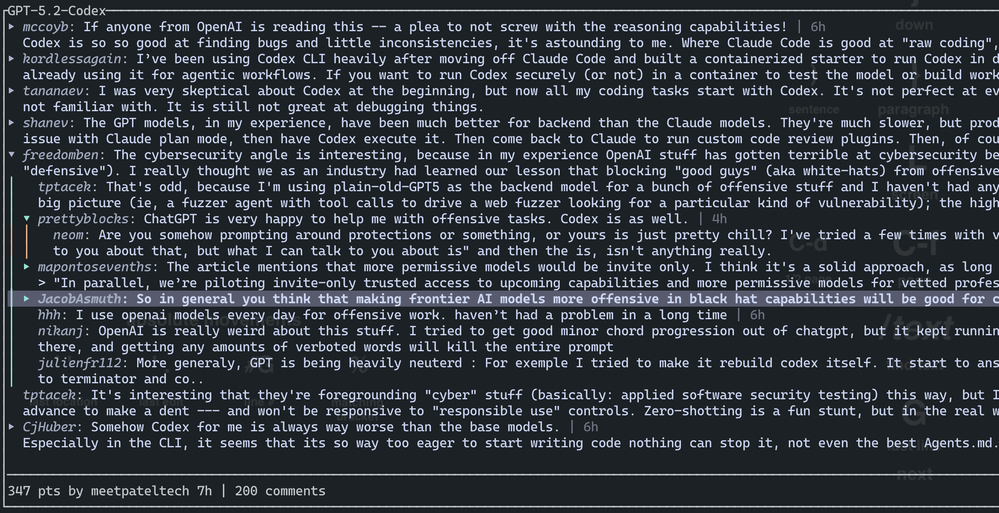

# hntui

Hacker News TUI — top stories + nested comments.

## Screenshots




## Install

```bash
# macOS / Linux Homebrew
brew install rocrp/tap/hntui

# Linux (no Homebrew)
curl -fsSL https://raw.githubusercontent.com/rocrp/hntui/main/scripts/install.sh | bash
```

## Keys

**Stories**

| Key | Action |
|-----|--------|
| `j/k`, `↓/↑` | Move |
| `gg` / `G` | Top / bottom |
| `Ctrl+d/u` | Page down / up |
| `Enter`, `Space`, `l`, `→` | Open comments |
| `o` / `O` | Open source / HN link |
| `f` | Filter feed |
| `/` | Search |
| `s` | Summarize (requires LLM key) |
| `r` | Refresh |
| `?` | Help |
| `q`, `Esc` | Quit |

**Comments**

| Key | Action |
|-----|--------|
| `j/k`, `↓/↑` | Move |
| `gg` / `G` | Top / bottom |
| `Ctrl+d/u` | Page down / up |
| `h/l`, `←/→` | Collapse / expand thread |
| `Enter`, `c` | Toggle collapse |
| `o` / `O` | Open HN / source link |
| `r` | Refresh |
| `q`, `Esc` | Back |

## Themes

Built-in themes via `--theme`:

```bash
hntui --theme default   # Color (catppuccin frappe)
hntui --theme eink      # 16-level grayscale for e-ink displays
```

Without `--theme`, hntui searches for `ui-config.toml` (see below).

## Configuration

### Config search order

1. Current working directory
2. `hntui` binary directory
3. `~/.config/hntui/` (recommended)

Explicit paths: `hntui --ui-config PATH --plugin-config PATH`

### UI (`ui-config.toml`)

Colors, layout, score/comment heat scales. Copy the default as starting point:

```bash
mkdir -p ~/.config/hntui
curl -fsSL https://raw.githubusercontent.com/rocrp/hntui/main/ui-config.toml \
  -o ~/.config/hntui/ui-config.toml
```

| Section | Key | Description |
|---------|-----|-------------|
| `[layout]` | `comment_max_lines` | Max lines per comment (`-1` = unlimited) |
| `[layout]` | `comment_default_visible_levels` | Depth shown on open (`1` = top-level only) |
| `[palette]` | color keys | Hex colors for text, backgrounds, accents |
| `[palette]` | `rainbow` | 10-color array for depth + score accents |
| `[score_scale]` | `steps` | Background color per score threshold |
| `[comment_scale]` | `steps` | Background color per comment-count threshold |

### AI summarization (`plugin-config.toml`)

Press `s` on any story to summarize its discussion. Requires an LLM API key.

```bash
curl -fsSL https://raw.githubusercontent.com/rocrp/hntui/main/plugin-config.toml \
  -o ~/.config/hntui/plugin-config.toml
```

```bash
export HNTUI_LLM_API_KEY="your-key-here"
```

Or set `api_key` in `plugin-config.toml`. Default uses Gemini (`gemini-flash-lite-latest`). For OpenAI or compatible APIs:

```toml
[summarize]
api_url = "https://api.openai.com/v1/chat/completions"
model = "gpt-4o-mini"
```
